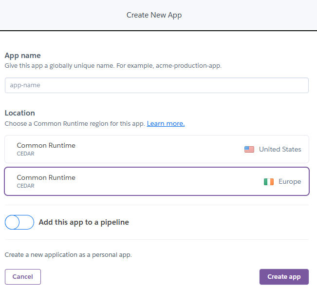

# Backend Heroku Deployment

https://dashboard.heroku.com/apps/fisma-benefit-app

Backend urls look like this: https://fisma-benefit-app-f46bf93af467.herokuapp.com/

Logs:
```
heroku logs --tail --app fisma-benefit-app
```

[Updating the Backend](#4-updating-the-backend)

## 1. Requirements

- Heroku account (credit card needed for account)
- Email address
- Running database and its credentials (url, username and password)

## 2. Repository clone

### 1. Clone the repository

Clone the backend folder from the repository at https://github.com/loota/fisma-backend-alt.

### 2. Edit build.gradle file

Find the file build.gradle from the root of the file. In the following lines of the file, make sure the version is 21:

```
java {
    toolchain {
        languageVersion = JavaLanguageVersion.of(21)
    }
}
```

## 2. Heroku deployment

### 1. Create app

Navigate to your dashboard and click New -> Create new app.
Then enter your app's name and select Europe. Click Create app.



### 2. Configure app settings

Navigate to settings.


Click on Reveal Config Vars.


Create Key-value pairs for the credentials of your database (username, password and url), where the key is one of the following datasource variables and the value is the actual value for your database:


### 3. Configure GitHub-repository

Navigate to Deploy.


Select GitHub as the deployment method.
Enter your repository name in the field and click search:


If successful, you should see the app connecting to github:


Select the correct branch and click Deploy Branch.


### 4. Updating the backend

After commiting changes to the appopriate github repository, go back to heroku and press *deploy*.
the backend resides at https://github.com/loota/fisma-backend-alt

Currently we have to commit changes to that backend repo by manually copying them from this main repo.
 


### 5. Set up Heroku CLI

Install heroku CLI from https://devcenter.heroku.com/articles/heroku-cli

In your console, enter 

```
heroku login
```

Accept the login prompt in your browser:


To view detailed logs from your app, enter in your console:
```
heroku logs --tail --app fisma-benefit-app
```

Where `fisma-benefit-app` is the name you entered when creating the app.

