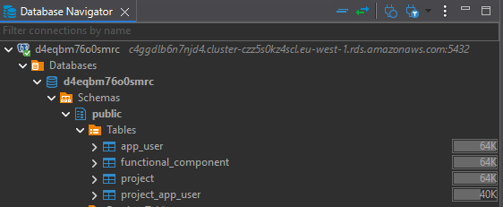
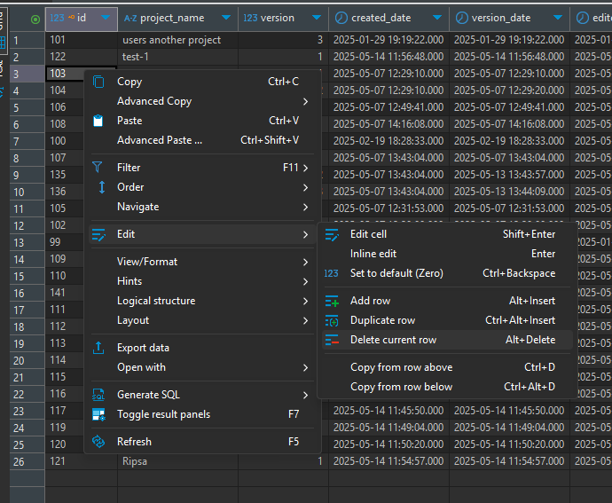

# Database manual

This is manual for Benefit-app's staging -database. You can use SQL Shell to access it, or any graphic database tool. In this example, a free tool called DBeaver is used.

## Access deployed database
Using heroku cli:

`heroku pg:psql postgresql-graceful-97698 --app fisma-benefit-app`

Or use psql with the credentials from Heroku -> Postgres -> Settings -> Database Credentials -> View credentials

## Access local database
See **compose.yaml** for credentials.

Using Docker

`Docker exec -it benefit-app-postgres-1 psql -U POSTGRES_USER POSTGRES_DB`

Or psql

## 1) Where is database published?

It was deployed to Heroku platform.
Please read more from

## 2) How to access the database using DBeaver

### 1. Install DBeaver: https://dbeaver.io/download/

### 2. Select Database -> New Connetion from JDBC URL:


### 3. Enter your database url:

It should be in the following format:

`jdbc:postgresql://xxxxxx.xxxxx.xxxxx.amazonaws.com:5432/db_name`

Into the opening window and click proceed:


### 4. Enter username and password in the opening window:


### 5. The database connection opens in the window on the left:




### 6. The tables can be opened and will be displayed in the central window:

Data contained in the table is shown in the data-tab:


### 7: Right-clicking the rows opens a menu where data can be deleted, edited. etc.:





## 3) How to access database with SQL Shell

You need to install latest version of PostgreSQL DBMS in your workstation via e.g. installer from official PostgreSQL website:
https://www.postgresql.org/

Our group had 17.4.2 version during development cycle.

The software is called SQL Shell in your Windows. You can activate it 
via terminal:

```
psql
```

Then you have insert credentials to access staging -database.

2) Where are credentials?

See README.md documentation from backend-credentials -repository on 
fisma-benefit-app organisation at Github.

Canonically, the credentials can be also found from Heroku.
First go data.heroku.com and login with Heroku credentials.

Then move to Add-On Services section and click "Heroku Postgres" -service from the Heroku dashboard.

Lastly move from Overview to Settings -tab, move then to ADMINISTRATION -> Database Credentials section and click finally "View Credentials" -button. 

In the terminal, add Host credentials in server location:
```
Server [localhost]: [INSERT Host]
```

Second, add Database credentials in database section:
```
Database [postgres] : [INSERT Database]
```

Third, add Port credentials in port section:
```
Port [5432] : [INSERT Port]
```

Fourth, add User credentials in username section:
```
Username: [Insert User]
```

Fifth and final, add Password in 
```
Password: [Insert Password]
```
