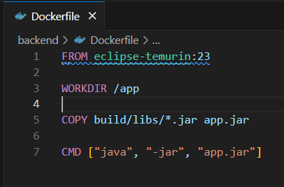
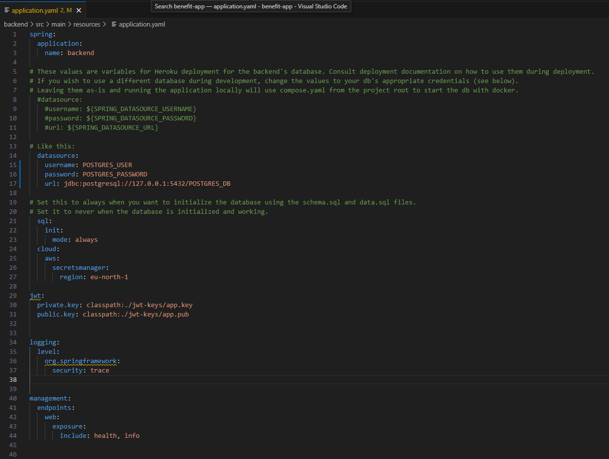

# Benefit-app docker

This is manual for setting up docker for the backend,
specifically in local and deployment environment.

## 1. Essential docker files' and their configuration.

The essential docker files in the Benefit-app are following:

* **compose.yaml** in root directory of benefit-app  (i.e. './' ).
It contains credentials and configurations for booting up 
PostgreSQL image in the Benefit-app.
W

Image: The compose.yaml -file.

Note from above image! The INSERT_DB, INSERT_PASSWORD,
and INSERT_USER are just placeholder. You need to 
have the correct values for db, password and user
in PostgreSQL, give by Fisma ry.

* **Dockerfile** in backend directory of benefit-app (i.e. './backend/').
This is for building a jar of Java with Gradle -code to the backend's build library (i.e. './backend/build/libs/').



* **application.yaml** in resource directory of backend's main directory.
(i.e './backend/src/main/resources/').



This is very *important* yaml file, since this has to be re-configured
depending if you are using backend in *local environment* or trying to
*deploy backend to Heroku platform*.

a) For local environment:

Make sure that following credentials are inserted (non-commented)
in the application.yaml file:

```sh
  datasource:
    username: POSTGRES_USER
    password: POSTGRES_PASSWORD
    url: jdbc:postgresql://127.0.0.1:5432/POSTGRES_DB
```

The values for POSTGRES_USER, POSTGRES_PASSWORD
and POSTGRES_DB are taken from compose.yaml file
at the root directory ('./compose.yaml').

Then, make sure that you have configured sql mode as *always*.

```sh
  sql:
    init:
      mode: always
```

b) For Heroku deployment environment:

Make sure that following credentials are inserted (non-commented)
in the application.yaml file:

```sh
  datasource:
    username: ${SPRING_DATASOURCE_USERNAME}
    password: ${SPRING_DATASOURCE_PASSWORD}
    url: ${SPRING_DATASOURCE_URL}
```

Then, make sure that you have configured sql mode as *never*.

```sh
  sql:
    init:
      mode: never
```

## 2. Docker validation check.

Next, make sure you have the Docker
is installed in your workstation,
e.g. Docker Desktop. You can check
that have the current version of Docker
installed via command

```sh
docker --version
```


Image: A screenshot of Docker desktop with the benefit-app dockerized.

## 3. Activating PostgreSQL via Docker compose.

After all validations and checking,
you should able to active Postgresql
via docker compose's command

```sh
docker compose up -d
```

in the Drive:/path/to/benefit-app -directory.
Please note the last option `-d`, which
will run PostgreSQL's docker in background.
If you forgot write it, then you need to close
the CLI and reopen it again.

Alternatively, you can shut down docker via 
keybindings CTRL+C and run docker compose again.


Image: An example of successful output from docker compose up.

## 4. Database query management via Docker exec.

Additionally, you have to check that database accepts 
incoming queries. You can check database's query management
via command

```sh
docker exec -it INSERT_CONTAINER_NAME psql -U POSTGRES_USER POSTGRES_DB
```

Values for POSTGRES_USER and POSTGRES_DB are taken from compose.yaml file
at the root directory ('./compose.yaml').

Meanwhile INSERT_CONTAINER_NAME is name for current container,
that is actively running benefit-app image.

For getting getting correct container name,
the easiest way to check is via command

```sh
docker ps
```
As example in our workstation, our container is named
benefit-app-postgres-1 , like in the image below:


Image: Result from command 'docker ps'.

Hence our command will be
```sh
docker exec -it benefit-app-postgres-1 psql -U POSTGRES_USER POSTGRES_DB
```
